# 🎓 JIIT Assistant

<div align="center">
  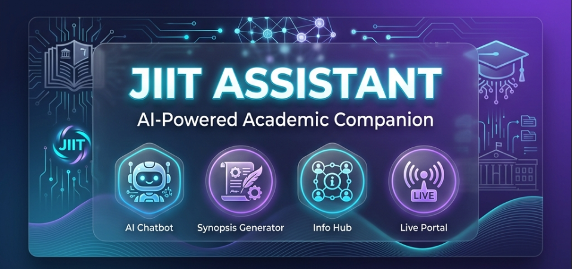
</div>

A comprehensive AI-powered web application for JIIT (Jaypee Institute of Information Technology) students and faculty, providing intelligent assistance for academic projects and institutional information.

## 🚀 Live Demo

[](https://jiitbot-assistant.streamlit.app/)

**🌐 Try it now:** [https://jiitbot-assistant.streamlit.app/](https://jiitbot-assistant.streamlit.app/)

> **Note for Visitors:** The app is live and fully functional! Explore all 4 features:
> - 🤖 AI Chatbot for JIIT queries
> - 📊 Project Synopsis Generator
> - 🏫 JIIT Information Hub
> - 📡 Live Portal with AI insights

---


## 📋 Table of Contents

- [Features](#features)
- [Screenshots](#screenshots)
- [Architecture](#architecture)
- [Installation](#installation)
- [Usage](#usage)
- [Project Structure](#project-structure)
- [Technologies Used](#technologies-used)
- [Configuration](#configuration)
- [Deployment](#deployment)
- [Contributing](#contributing)
- [Authors](#authors)
- [License](#license)


## ✨ Features

### 1. 🤖 AI-Powered Chatbot
- **Hybrid Search System**: Combines FAISS (semantic search) and BM25 (keyword search) for optimal information retrieval
- **LLM Integration**: Uses Groq/OpenAI for generating natural, context-aware responses
- **Web Scraping**: Automatically crawls and indexes JIIT website content
- **Source Citation**: All responses include citations from official JIIT sources
- **PDF Support**: Processes and indexes PDF documents from the JIIT website
- **Intelligent Caching**: Minimizes redundant web requests with smart caching

### 2. 📊 Project Synopsis Generator
- **AI-Powered Content**: Uses Google Gemini to generate professional project content
- **Dual Format Output**: Generates both PDF and DOCX formats
- **JIIT Branding**: Professional cover page with JIIT logo and formatting
- **Automatic Sections**: 
  - Objective
  - Introduction
  - Key Features
  - Technologies Used
  - References
- **Image Support**: Add custom diagrams and screenshots
- **Smart Pagination**: Automatic text wrapping and page breaks

### 3. 🏫 JIIT Information Hub
- **Social Media Aggregator**: Embedded content from all official JIIT platforms
- **YouTube Integration**: Featured campus tours and student experiences
- **Multi-Platform Support**:
  - Instagram (@jiit.official)
  - Facebook (/jiitofficial)
  - Twitter (@JaypeeUniversi2)
  - LinkedIn (Jaypee Institute of Information Technology)
  - Reddit discussions

### 4. 📡 JIIT Live Portal (NEW!)
- **Real-Time Updates**: Live scraping of JIIT website for latest information
- **Future Events Only**: Smart filtering to show only upcoming events
- **AI-Powered Insights**:
  - Sentiment analysis of announcements and news
  - Event popularity predictions using ML
  - Personalized event recommendations
  - Attendance trend forecasting with interactive charts
- **Auto-Refresh**: Configurable automatic data refresh (2-15 minutes)
- **Interactive Dashboard**: Live metrics and statistics
- **Smart Filtering**: Automatically filters out past events
- **ML Technologies**: scikit-learn, TextBlob, Plotly visualizations

## 📸 Screenshots

### � Homepage
The main landing page with glassmorphism cards and animated gradients.

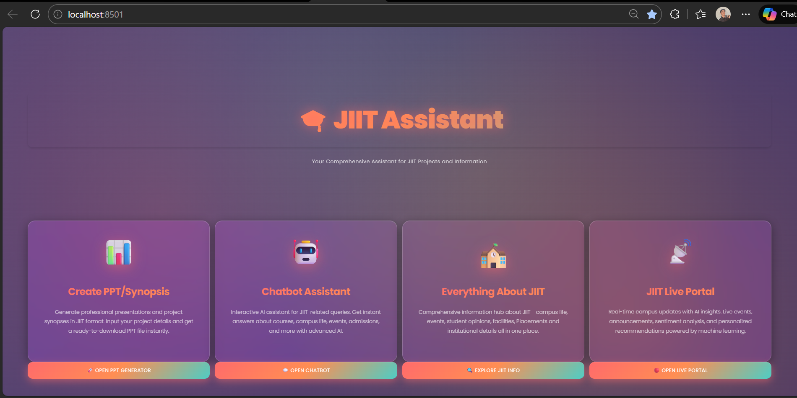

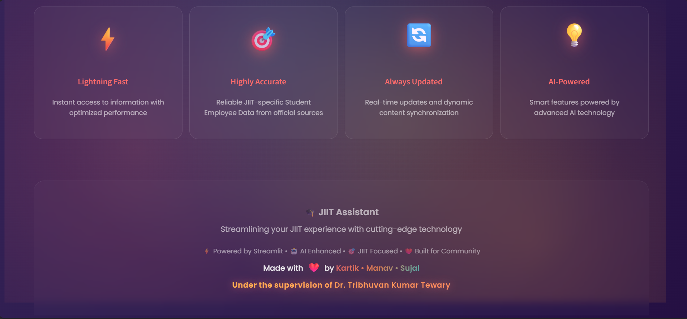

---

### 🤖 AI Chatbot

#### Chatbot Interface
Interactive AI assistant with sidebar always visible for easy access.

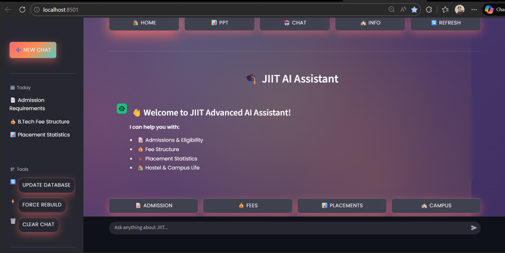

#### Sample Query - Admissions
Example of chatbot answering questions about JIIT admissions with source citations.


#### Query Result - Admissions
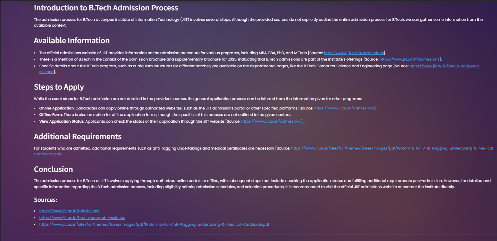


### 📊 PPT/Synopsis Generator

#### Input Form
User-friendly form for entering project details, team members, and guides.

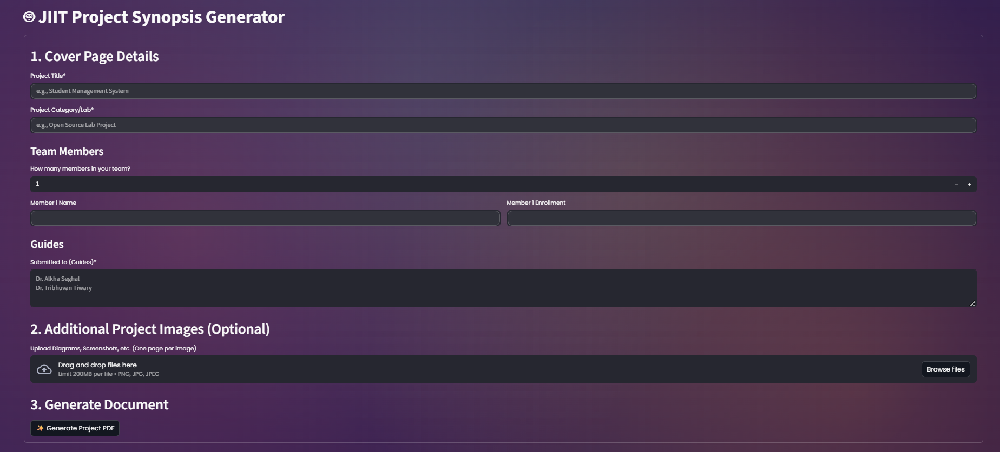

#### Generated PDF Example
View the complete generated PDF for a sample project:

📄 **[Student Management System Synopsis.pdf](screenshots/STUDENT_MANAGEMENT_SYSTEM_Synopsis%20(6).pdf)** - Click to view the full generated synopsis

*This is a complete example showing the JIIT-branded cover page, project details, and all auto-generated sections.*

---

### 🏫 JIIT Information Hub

#### YouTube Videos Section
Embedded campus tour and student experience videos.

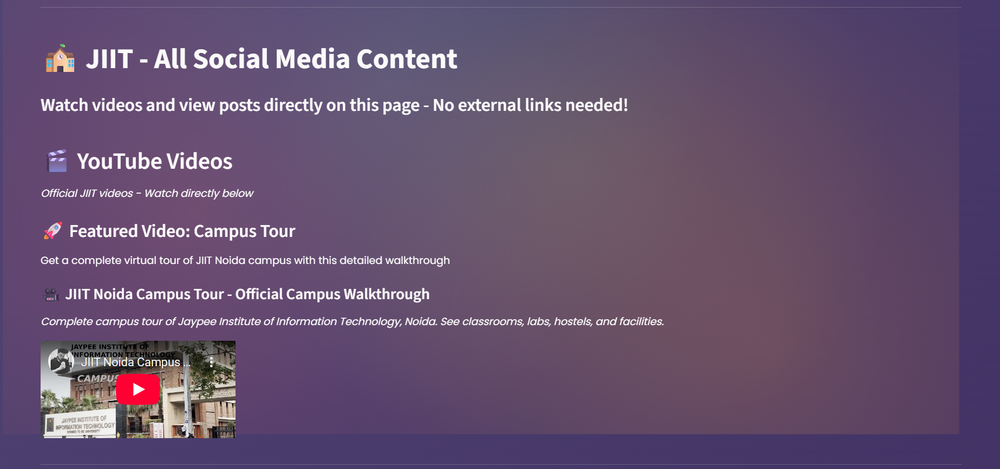
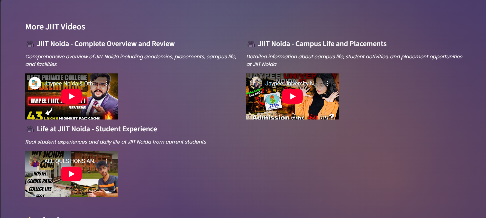

#### Social Media Feeds
Integrated Instagram, Facebook, and Twitter feeds.

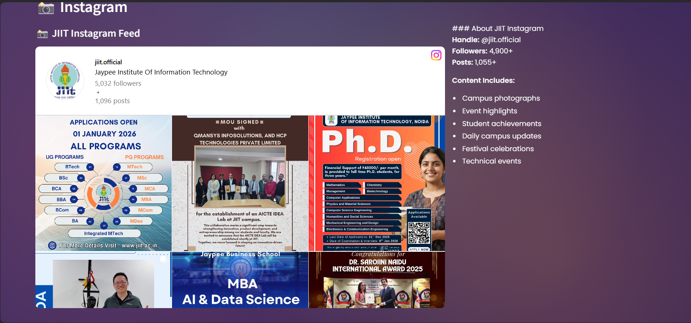
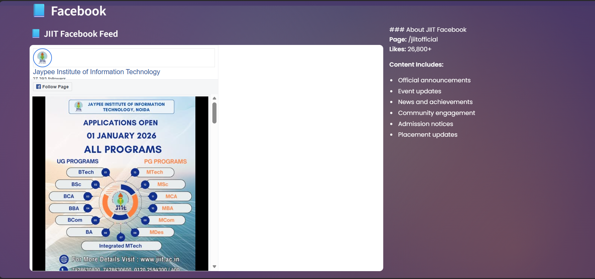

#### Complete Platform Overview
All JIIT social media platforms in one place.
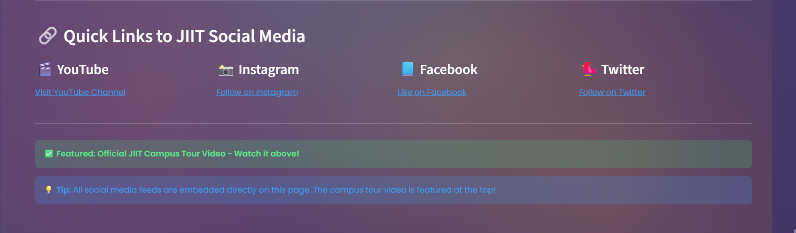

---

### 📡 JIIT Live Portal (NEW!)

#### Live Dashboard
Real-time campus updates with upcoming events and announcements.

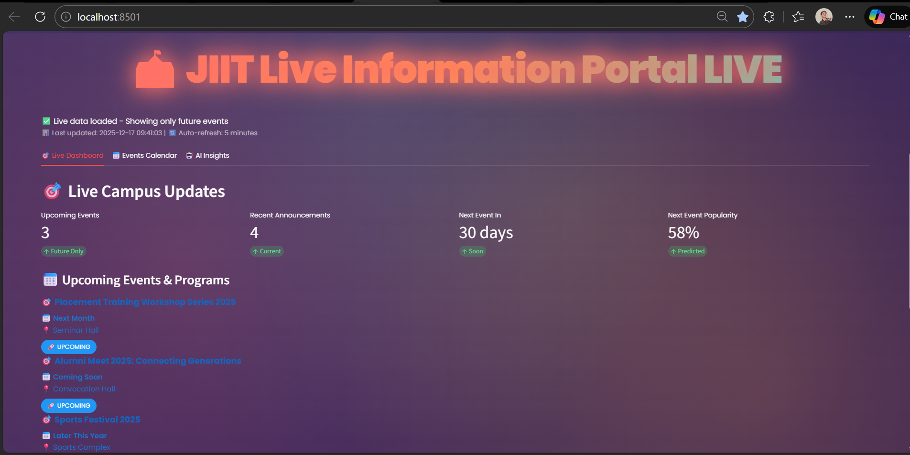
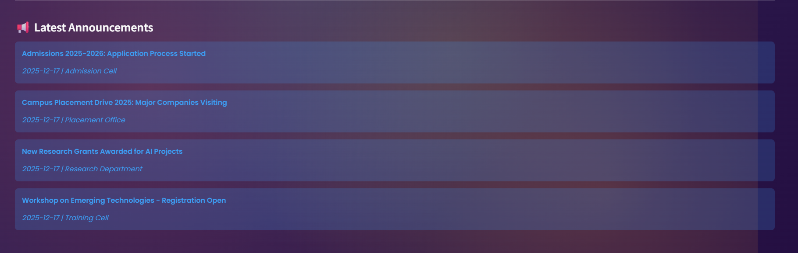

#### Events Calendar
Comprehensive calendar showing all future events with details.

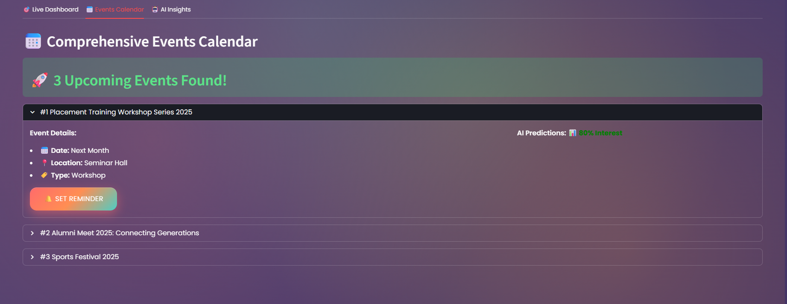

#### AI-Powered Insights
Sentiment analysis, event popularity predictions, and personalized recommendations.

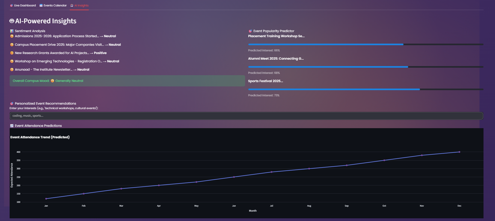

#### Interactive Features
Auto-refresh controls, AI toggles, and attendance trend forecasting.


---


## 🏗️ Architecture

```
┌───────────────────────────────────────────────────────────────────────────────┐
│                          JIIT Assistant Platform                              │
│                     4 AI-Powered Features in One System                       │
├───────────────────────────────────────────────────────────────────────────────┤
│                                                                               │
│  ┌──────────────┐  ┌──────────────┐  ┌──────────────┐  ┌──────────────┐   │
│  │   Chatbot    │  │ PPT Generator│  │  Info Hub    │  │  Live Portal │   │
│  │   🤖 AI      │  │   📊 AI      │  │   🏫 Social  │  │   📡 AI/ML   │   │
│  ├──────────────┤  ├──────────────┤  ├──────────────┤  ├──────────────┤   │
│  │• Web Scraper │  │• Gemini AI   │  │• YouTube     │  │• Web Scraper │   │
│  │• FAISS Index │  │• PDF Gen     │  │• Instagram   │  │• Event Filter│   │
│  │• BM25 Search │  │• DOCX Gen    │  │• Facebook    │  │• Sentiment   │   │
│  │• Groq/OpenAI │  │• JIIT Brand  │  │• Twitter     │  │• Predictions │   │
│  │• Hybrid Rank │  │• Auto Format │  │• LinkedIn    │  │• TF-IDF Rec  │   │
│  │• Citations   │  │• Image Upload│  │• Reddit      │  │• Plotly Viz  │   │
│  └──────────────┘  └──────────────┘  └──────────────┘  └──────────────┘   │
│                                                                               │
│  ┌─────────────────────────────────────────────────────────────────────┐    │
│  │                        Shared Components                             │    │
│  ├─────────────────────────────────────────────────────────────────────┤    │
│  │  • Streamlit UI Framework  • Custom CSS & Animations                │    │
│  │  • Session State Management • Responsive Design                     │    │
│  │  • API Key Management      • Error Handling                         │    │
│  └─────────────────────────────────────────────────────────────────────┘    │
│                                                                               │
└───────────────────────────────────────────────────────────────────────────────┘
```

### Feature Architectures

#### 1. 🤖 AI Chatbot Architecture

**Three-Layer Design:**

1. **Web Scraping Layer**
   - Crawls JIIT website using sitemap.xml
   - Processes HTML and PDF documents
   - Intelligent caching (24-hour validity)
   - Content classification and metadata extraction

2. **Indexing Layer**
   - **FAISS**: Semantic search using sentence transformers (384-dim embeddings)
   - **BM25**: Keyword-based search for exact matches
   - **Hybrid Fusion**: Reciprocal rank fusion for optimal results
   - Stores 1000+ documents with efficient retrieval

3. **Response Generation Layer**
   - **Primary**: Groq API (llama-3.3-70b-versatile)
   - **Fallback**: OpenAI API (gpt-4o-mini)
   - Context-aware responses with source citations
   - Offline fallback mode

---

#### 2. 📊 PPT/Synopsis Generator Architecture

**AI-Powered Content Pipeline:**

1. **Input Processing**
   - Project title and details collection
   - Team member and guide information
   - Optional image uploads

2. **AI Content Generation**
   - **Google Gemini AI** (gemini-flash-latest)
   - Generates: Objective, Introduction, Key Features, Technologies, References
   - JIIT-specific academic formatting

3. **Document Generation**
   - **PDF**: ReportLab with custom JIIT branding
   - **DOCX**: python-docx with professional formatting
   - Auto-pagination and text wrapping
   - Image integration and layout optimization

---

#### 3. 🏫 JIIT Information Hub Architecture

**Social Media Aggregation:**

1. **Content Sources**
   - YouTube API integration
   - Instagram embed widgets
   - Facebook page plugins
   - Twitter timeline widgets
   - LinkedIn company page
   - Reddit community feeds

2. **Display Layer**
   - Responsive iframe embeds
   - Platform-specific styling
   - Quick navigation links
   - Real-time content updates

---

#### 4. 📡 JIIT Live Portal Architecture (NEW!)

**Real-Time AI/ML System:**

1. **Data Collection Layer**
   - **Web Scraper**: Real-time JIIT website scraping
   - **Smart Filtering**: Future events only (date parsing)
   - **Auto-Refresh**: Configurable 2-15 minute intervals
   - **Caching**: Intelligent data caching

2. **AI/ML Processing Layer**
   - **Sentiment Analysis**: TextBlob NLP for announcements
   - **Event Popularity**: ML-based prediction scoring
   - **Recommendations**: TF-IDF + Cosine Similarity
   - **Trend Forecasting**: Attendance predictions

3. **Visualization Layer**
   - **Plotly Charts**: Interactive trend visualizations
   - **Live Dashboard**: Real-time metrics and statistics
   - **Event Calendar**: Expandable event details
   - **AI Insights Tab**: Sentiment and predictions display

4. **User Interaction**
   - Personalized event recommendations
   - Event reminder system
   - AI feature toggles
   - Custom refresh controls

---

### Technology Stack by Feature

| Feature | Primary Technologies |
|---------|---------------------|
| **Chatbot** | FAISS, BM25, Groq/OpenAI, BeautifulSoup, Sentence Transformers |
| **PPT Generator** | Google Gemini AI, ReportLab, python-docx, PIL |
| **Info Hub** | YouTube API, Social Media Embeds, Streamlit Components |
| **Live Portal** | scikit-learn, TextBlob, Plotly, pandas, BeautifulSoup |
| **Shared** | Streamlit, Python 3.8+, Custom CSS, Session Management |

## 🚀 Installation

### Prerequisites
- Python 3.8 or higher
- pip package manager
- Git (for cloning)

### Step 1: Clone the Repository
```bash
git clone https://github.com/YOUR_USERNAME/JiitBot.git
cd JiitBot
```

### Step 2: Create Virtual Environment (Recommended)
```bash
# Windows
python -m venv venv
venv\Scripts\activate

# Linux/Mac
python3 -m venv venv
source venv/bin/activate
```

### Step 3: Install Dependencies
```bash
pip install -r requirements.txt
```

### Step 4: Set Up Environment Variables
Create a `.env` file in the project root:
```env
GROQ_API_KEY=your_groq_api_key_here
OPENAI_API_KEY=your_openai_api_key_here
```

**Note**: You need at least one API key. Get them from:
- Groq: https://console.groq.com/
- OpenAI: https://platform.openai.com/

### Step 5: Add JIIT Logo
Place `jiit_logo.png` in the project root directory for the PPT generator to work properly.

## 💻 Usage

### Running the Application
```bash
streamlit run app.py
```

The application will open in your default browser at `http://localhost:8501`

### Using the Chatbot
1. Navigate to the Chatbot section
2. Ask questions about JIIT (admissions, placements, facilities, etc.)
3. The chatbot will search the knowledge base and provide cited responses

### Generating Project Synopsis
1. Navigate to the PPT Generator section
2. Fill in project details:
   - Project title
   - Category/Lab
   - Team members (names and enrollment numbers)
   - Guide names
3. Optionally upload images
4. Click "Generate Project PDF"
5. Download both PDF and DOCX formats

### Exploring JIIT Information
1. Navigate to the JIIT Info section
2. Browse embedded social media content
3. Watch campus tour videos
4. View latest updates from all platforms

### Using JIIT Live Portal
1. Click on "🔴 Open Live Portal" from homepage
2. View real-time campus updates and upcoming events
3. Enable AI Insights from sidebar for predictions
4. Enter your interests for personalized recommendations
5. Configure auto-refresh rate (2-15 minutes)
6. Set reminders for upcoming events

## 📁 Project Structure

```
JiitBot/
├── app.py                  # Main application entry point
├── chatbot.py             # AI chatbot implementation
├── ppt_generator.py       # Synopsis generator
├── jiit_info.py           # Social media hub
├── jiit_live.py           # Live portal with AI insights (NEW!)
├── requirements.txt       # Python dependencies
├── .gitignore            # Git ignore rules
├── .env                  # Environment variables (not in repo)
├── jiit_logo.png         # JIIT logo (add manually)
├── README.md             # This file
├── LICENSE               # MIT License
├── SCREENSHOT_GUIDE.md   # Guide for taking screenshots
│
├── screenshots/          # Project screenshots
│   └── CHECKLIST.md     # Screenshot checklist
│
├── jiit_data/            # Generated data (gitignored)
│   ├── cache/           # Cached web pages
│   ├── faiss_index/     # FAISS vector index
│   ├── bm25_index/      # BM25 keyword index
│   └── documents/       # Processed documents
│
└── .streamlit/          # Streamlit config (gitignored)
    └── secrets.toml     # API keys
```

## 🛠️ Technologies Used

### Frontend & Framework
- **Streamlit**: Web application framework
- **HTML/CSS**: Custom styling and animations

### AI & Machine Learning
- **Sentence Transformers**: Text embeddings for semantic search
- **FAISS**: Vector similarity search
- **BM25**: Keyword-based search algorithm
- **Groq API**: Fast LLM inference (Llama 3.3 70B)
- **OpenAI API**: GPT-4o-mini for responses
- **Google Gemini**: Content generation for synopses

### Document Processing
- **BeautifulSoup4**: HTML parsing
- **PyPDF2**: PDF text extraction
- **ReportLab**: PDF generation
- **python-docx**: DOCX generation

### Data & Storage
- **NumPy**: Numerical operations
- **Pickle**: Index serialization
- **JSON**: Data storage

### Web Scraping
- **Requests**: HTTP requests
- **XML ElementTree**: Sitemap parsing

## ⚙️ Configuration

### Chatbot Configuration (`chatbot.py`)
```python
MAX_PAGES = 1000              # Maximum pages to scrape
CACHE_VALIDITY_HOURS = 24     # Cache expiration
FAISS_TOP_K = 15             # Top semantic results
BM25_TOP_K = 15              # Top keyword results
FINAL_TOP_K = 8              # Final results after fusion
LLM_TEMPERATURE = 0.2        # Response randomness
LLM_MAX_TOKENS = 1200        # Max response length
```

### Customization
- Modify CSS in `app.py` for styling changes
- Update `Config` class in `chatbot.py` for scraping parameters
- Adjust prompts in `ppt_generator.py` for content generation

## 🤝 Contributing

Contributions are welcome! Please follow these steps:

1. Fork the repository
2. Create a feature branch (`git checkout -b feature/AmazingFeature`)
3. Commit your changes (`git commit -m 'Add some AmazingFeature'`)
4. Push to the branch (`git push origin feature/AmazingFeature`)
5. Open a Pull Request

## 👥 Authors

**Team Members:**
- **Kartik**
- **Manav**
- **Sujal**

**Supervisor:**
- **Dr. Tribhuvan Kumar Tewary**

**Institution:**
- Jaypee Institute of Information Technology (JIIT), Noida

## 🌐 Deployment

### Live Application

The JIIT Assistant is deployed and accessible at:

**🔗 [https://jiitbot-assistant.streamlit.app/](https://jiitbot-assistant.streamlit.app/)**

### Deployment Platform

- **Platform:** Streamlit Cloud
- **Status:** ✅ Live and Running
- **Uptime:** 24/7 (with auto-sleep after inactivity)
- **Updates:** Auto-deployed from GitHub main branch

### For Visitors

1. **Access the App:** Click the link above or the badge at the top
2. **No Installation Required:** Works directly in your browser
3. **All Features Available:** Try all 4 AI-powered features
4. **Free to Use:** No registration or payment needed

### For Developers

Want to deploy your own instance?

1. Fork this repository
2. Sign up for [Streamlit Cloud](https://streamlit.io/cloud)
3. Connect your GitHub repository
4. Add your API keys in Streamlit secrets
5. Deploy!

See `DEPLOYMENT_GUIDE.md` for detailed instructions.

## 📄 License

This project is licensed under the MIT License - see the [LICENSE](LICENSE) file for details.

## 🙏 Acknowledgments

- JIIT for providing the institutional data
- Groq for fast LLM inference
- Google for Gemini API
- Streamlit for the amazing framework
- All open-source contributors

## 📞 Contact

For questions or support, please open an issue on GitHub.

---

**Made with ❤️ by Kartik, Manav, and Sujal**

**Under the supervision of Dr. Tribhuvan Kumar Tewary**
